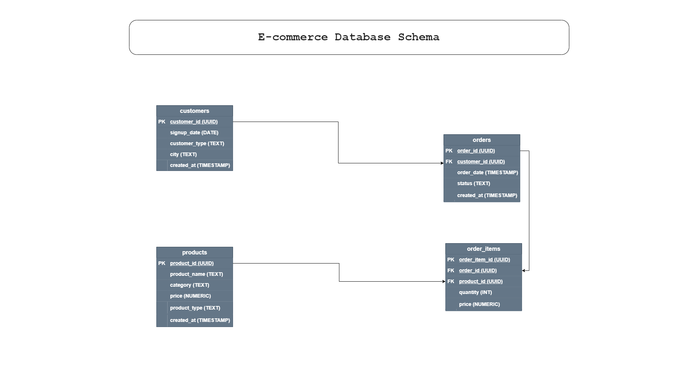
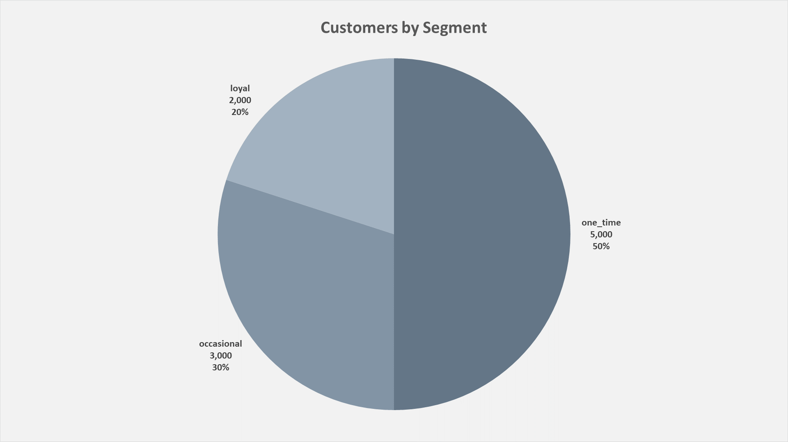
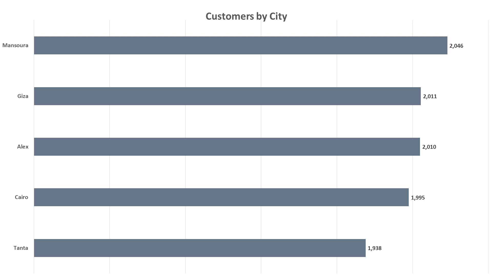

# **Analyzing Repeat Purchase Behavior in E-commerce**

## Project Overview
This project analyzes customer purchasing behavior in an e-commerce business
to identify potential reasons behind a low Repeat Purchase Rate (RPR).

Using SQL and PostgreSQL, the analysis explores customer activity,
order patterns, product pricing, cancellation behavior,
and category-level trends to better understand
what factors may influence customer retention and repeat buying behavior.

The project includes:
- Data modeling and schema design
- Exploratory Data Analysis (EDA)
- Business-focused SQL analysis
- Behavioral segmentation
- Data visualizations and business insights

## Business Problem
The business observed that a relatively small percentage of customers
make repeat purchases after their first completed order.

Since repeat customers are critical for long-term growth,
customer retention, and revenue stability,
the goal of this project is to investigate
possible factors contributing to low repeat purchase behavior.

The analysis focuses on answering questions such as:
- Does product pricing affect repeat purchases?
- Do some product categories retain customers better than others?
- Does order cancellation behavior impact customer retention?
- Are there customer behavior patterns linked to lower repeat purchase rates?

The objective is not only to measure the Repeat Purchase Rate,
but also to identify actionable insights
that could help improve customer retention.

## Dataset Description
| Table       | Description                             |
| ----------- | --------------------------------------- |
| customers   | Customer information and signup details |
| orders      | Customer orders and order status        |
| order_items | Products included in each order         |
| products    | Product catalog and pricing information |

## Schema Design

## Data Preparation & EDA
### Data Preparation
- Checked for missing values across all tables.
- Verified primary key uniqueness.
- Checked for duplicate records.
- Validated order status consistency.
- Confirmed relational integrity between tables.
- **No significant data quality issues were found.
The dataset was considered clean and suitable for analysis.**

### Exploratory Data Analysis (EDA)
- The **customers** table contains **10,000** customers, The **orders** table contains **25,096** orders, The **products** contains **1,200** products and the **order_items** table contains **62,454** records.

- Customer segmentation labels indicate that:
    - 50% of customers are classified as one-time customers.
    - 30% as occasional customers.
    - Only 20% as loyal customers.
- The customer type distribution may suggest relatively weak customer retention behavior, However, these labels are predefined and not directly derived
from transactional purchase behavior.

- 

