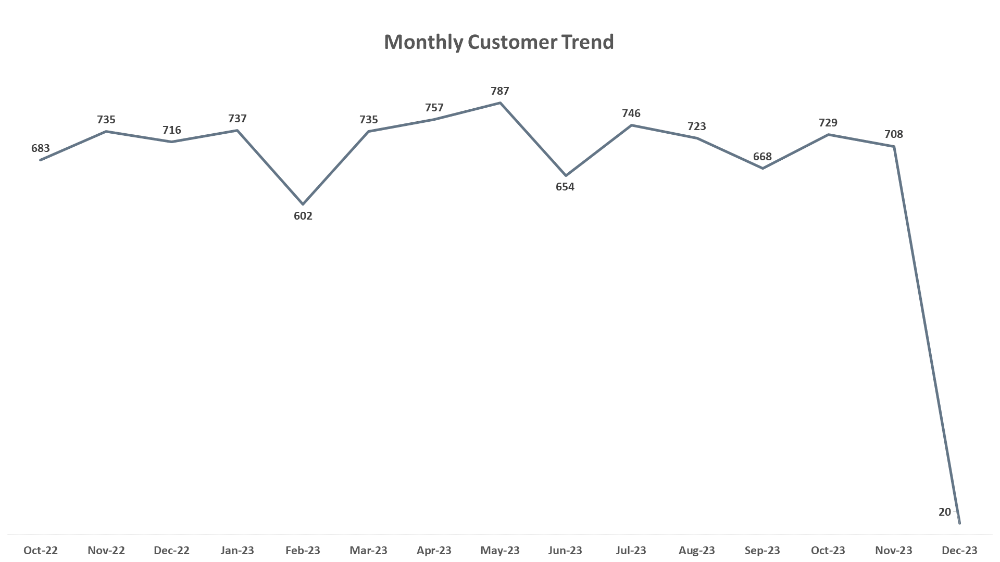
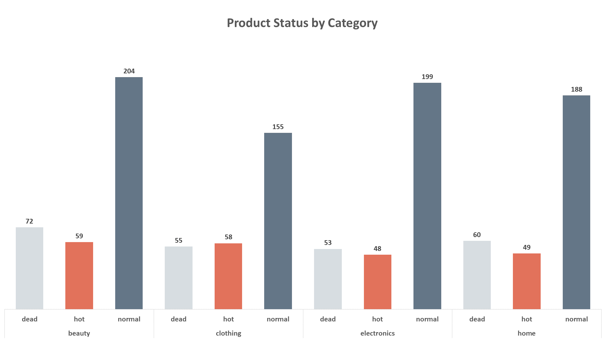

# **Analyzing Repeat Purchase Behavior in E-commerce**

## Project Overview
This project analyzes customer purchasing behavior in an e-commerce business
to identify potential reasons behind a low Repeat Purchase Rate (RPR).

Using SQL and PostgreSQL, the analysis explores customer activity,
order patterns, product pricing, cancellation behavior,
and category-level trends to better understand
what factors may influence customer retention and repeat buying behavior.

The project includes:
- Data modeling and schema design
- Exploratory Data Analysis (EDA)
- Business-focused SQL analysis
- Behavioral segmentation
- Data visualizations and business insights

## Business Problem
The business observed that a relatively small percentage of customers
make repeat purchases after their first completed order.

Since repeat customers are critical for long-term growth,
customer retention, and revenue stability,
the goal of this project is to investigate
possible factors contributing to low repeat purchase behavior.

The analysis focuses on answering questions such as:
- Does product pricing affect repeat purchases?
- Do some product categories retain customers better than others?
- Does order cancellation behavior impact customer retention?
- Are there customer behavior patterns linked to lower repeat purchase rates?

The objective is not only to measure the Repeat Purchase Rate,
but also to identify actionable insights
that could help improve customer retention.

## Dataset Description
| Table       | Description                             |
| ----------- | --------------------------------------- |
| customers   | Customer information and signup details |
| orders      | Customer orders and order status        |
| order_items | Products included in each order         |
| products    | Product catalog and pricing information |

## Schema Design

## Data Preparation & EDA
### Data Preparation
- Checked for missing values across all tables.
- Verified primary key uniqueness.
- Checked for duplicate records.
- Validated order status consistency.
- Confirmed relational integrity between tables.
- **No significant data quality issues were found.
The dataset was considered clean and suitable for analysis.**

### Exploratory Data Analysis (EDA)
- The **customers** table contains **10,000** customers, The **orders** table contains **25,096** orders, The **products** contains **1,200** products and the **order_items** table contains **62,454** records.

- Customer segmentation labels indicate that:
    - 50% of customers are classified as one-time customers.
    - 30% as occasional customers.
    - Only 20% as loyal customers.
- The customer type distribution may suggest relatively weak customer retention behavior, However, these labels are predefined and not directly derived
from transactional purchase behavior.
---

- Customer distribution across cities appears relatively balanced,
with no single city dominating the customer base.
- **Mansoura** has the highest number of customers (**2,046**),
followed closely by **Giza**, **Alexandria**, **Cairo**, and **Tanta**.
- This suggests that customer acquisition is geographically diversified
across multiple cities rather than concentrated in one region.
---

- Customer acquisition remained relatively stable throughout the observed period,
with monthly new customer counts generally ranging between **600** and **800** customers.
- The dataset covers customer signups from **October 2022** to **December 2023**,
No major fluctuations or consistent downward trends were observed in customer acquisition activity.
- **December 2023** shows an unusually low customer count (**20 customers**),
which appears to be caused by incomplete data for that month,
as only the first day of December is present in the dataset.
- Overall, the data does not indicate a significant customer acquisition issue,
suggesting that **low repeat purchase behavior** may be more related to retention
than acquisition performance.
---

- Product distribution across categories and product types
appears relatively consistent throughout the dataset.
- In all categories, **normal** products represent the majority of products,
while **hot** and **dead** products appear in smaller and relatively similar proportions.
- This balanced distribution may indicate that **product_type** values
are **predefined labels** rather than classifications directly derived
from actual product performance or sales behavior.
---
| Variable       | Value                      |
| -------------- | -------------------------- |
| min_price                 | 50.68           |
| max_price                 | 4,990.19        |
| avg_price                 | 1092.76         |
| price_range               | 4,939.51        |
| 1st_quratile              | 299.33          |
| median / 2nd_quratile     | 568.68          |
| 3rd_quratile              | 1,294.33        |
| standard_deviation        | 1,217.12        |
- Product prices show **high variability** across the dataset,
with prices ranging from **50.68** to **4,990.19**.
- The wide price range is expected due to the presence
of multiple product categories with different pricing structures,
such as **low-priced beauty products** and **higher-priced electronics**.
- The average product price (**1,092.76**) is significantly higher
than the median price (**568.68**), indicating a **right-skewed** price distribution, This suggests that a smaller number of **high-priced products
are pulling the average upward**.
- Additionally, the large standard deviation (**1,217.12**) and the wide spread between quartiles indicate **substantial price dispersion** across products.
- These patterns suggest the possible presence of **high-price outliers**,
which may influence customer purchasing behavior and repeat purchase activity.
---
| category       | product_count | category_avg_price | category_min_price | category_max_price |
| -------------- | ------------- | ------------------ | ------------------ | ------------------ |
| electronics    | 300           | 2,841.24           | 500.69             | 4,990.19           |
| home           | 297           | 836.70             | 208.10             | 1,490.32           |
| clothing       | 268           | 456.34             | 101.83             | 796.99             |
| beauty         | 335           | 263.11             | 50.68              | 497.99             |
- Inspection of the highest- and lowest-priced products
further confirms the category-level pricing patterns observed earlier.
- The most expensive products are primarily electronics products,
while the lowest-priced products mainly belong to the beauty category.
- These observations support the previously identified right-skewed price distribution and reinforce the assumption that electronics products are major contributors to overall price variability.