# **Analyzing Repeat Purchase Behavior in E-commerce**

## **Project Overview**
This project analyzes customer purchasing behavior in an e-commerce business
to identify potential reasons behind a low Repeat Purchase Rate (RPR).

Using SQL and PostgreSQL, the analysis explores customer activity,
order patterns, product pricing, cancellation behavior,
and category-level trends to better understand
what factors may influence customer retention and repeat buying behavior.

The project includes:
- Data modeling and schema design
- Exploratory Data Analysis (EDA)
- Business-focused SQL analysis
- Behavioral segmentation
- Data visualizations and business insights

## **Business Problem**
The business observed that a relatively small percentage of customers
make repeat purchases after their first completed order.

Since repeat customers are critical for long-term growth,
customer retention, and revenue stability,
the goal of this project is to investigate
possible factors contributing to low repeat purchase behavior.

The analysis focuses on answering questions such as:
- Does product pricing affect repeat purchases?
- Do some product categories retain customers better than others?
- Does order cancellation behavior impact customer retention?
- Are there customer behavior patterns linked to lower repeat purchase rates?

The objective is not only to measure the Repeat Purchase Rate,
but also to identify actionable insights
that could help improve customer retention.

## **Dataset Description**
| Table       | Description                             |
| ----------- | --------------------------------------- |
| customers   | Customer information and signup details |
| orders      | Customer orders and order status        |
| order_items | Products included in each order         |
| products    | Product catalog and pricing information |

## **Schema Design**
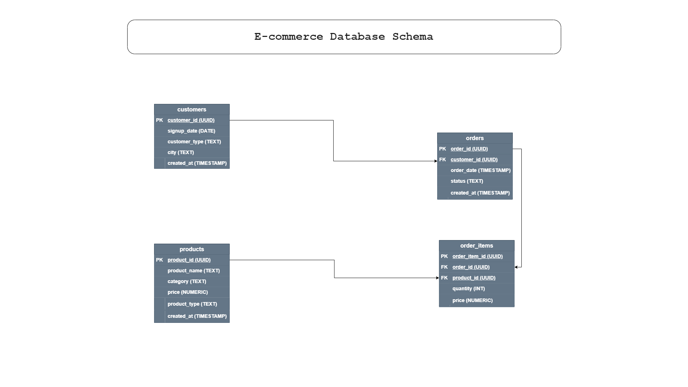

## **Data Preparation & EDA**
### Data Preparation
- Checked for missing values across all tables.
- Verified primary key uniqueness.
- Checked for duplicate records.
- Validated order status consistency.
- Confirmed relational integrity between tables.
- **No significant data quality issues were found.
The dataset was considered clean and suitable for analysis.**

### Exploratory Data Analysis (EDA)
- The **customers** table contains **10,000** customers, The **orders** table contains **25,096** orders, The **products** contains **1,200** products and the **order_items** table contains **62,454** records.

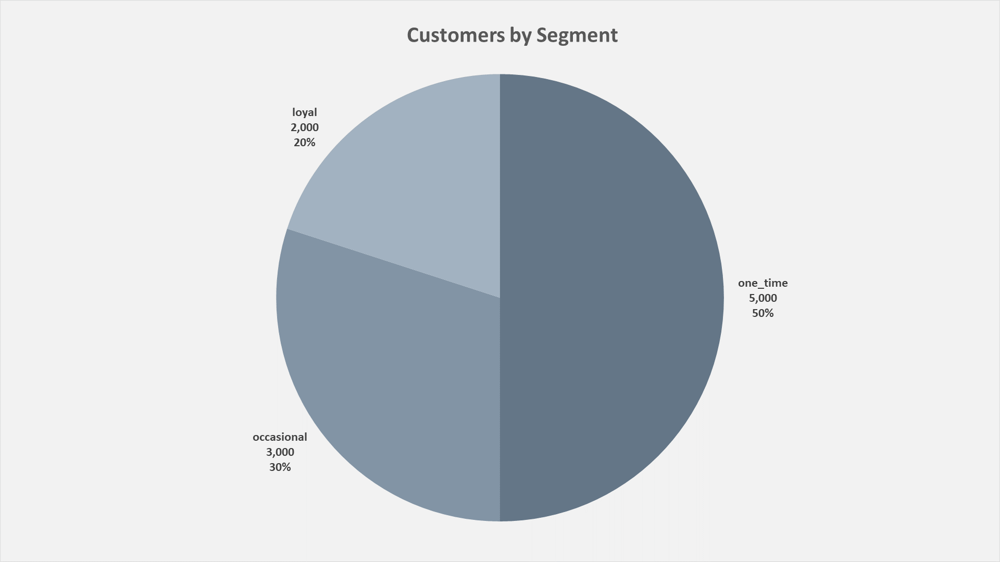
- Customer segmentation labels indicate that:
    - 50% of customers are classified as one-time customers.
    - 30% as occasional customers.
    - Only 20% as loyal customers.
- The customer type distribution may suggest relatively weak customer retention behavior, However, these labels are predefined and not directly derived
from transactional purchase behavior.
---
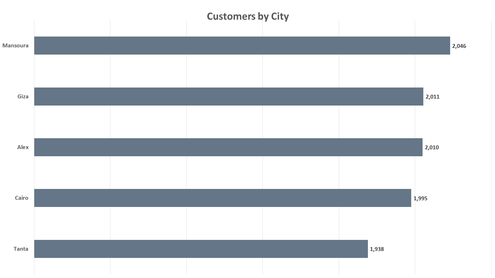
- Customer distribution across cities appears relatively balanced,
with no single city dominating the customer base.
- **Mansoura** has the highest number of customers (**2,046**),
followed closely by **Giza**, **Alexandria**, **Cairo**, and **Tanta**.
- This suggests that customer acquisition is geographically diversified
across multiple cities rather than concentrated in one region.
---
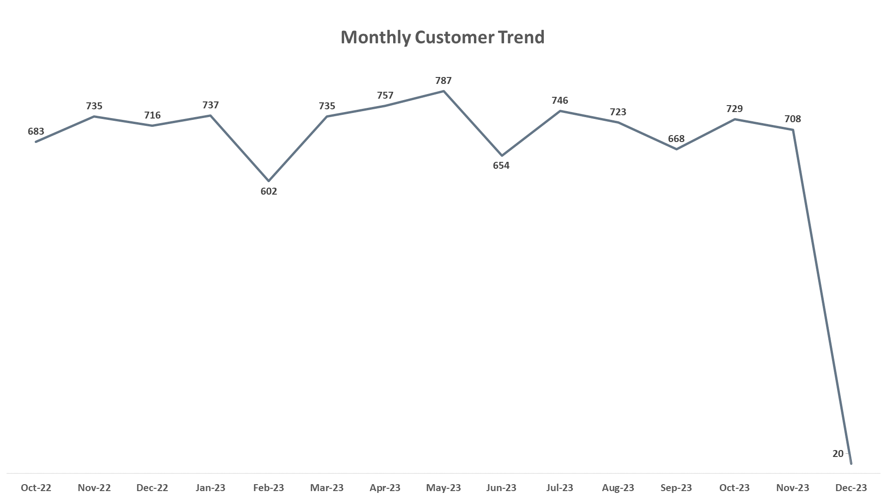
- Customer acquisition remained relatively stable throughout the observed period,
with monthly new customer counts generally ranging between **600** and **800** customers.
- The dataset covers customer signups from **October 2022** to **December 2023**,
No major fluctuations or consistent downward trends were observed in customer acquisition activity.
- **December 2023** shows an unusually low customer count (**20 customers**),
which appears to be caused by incomplete data for that month,
as only the first day of December is present in the dataset.
- Overall, the data does not indicate a significant customer acquisition issue,
suggesting that **low repeat purchase behavior** may be more related to retention
than acquisition performance.
---
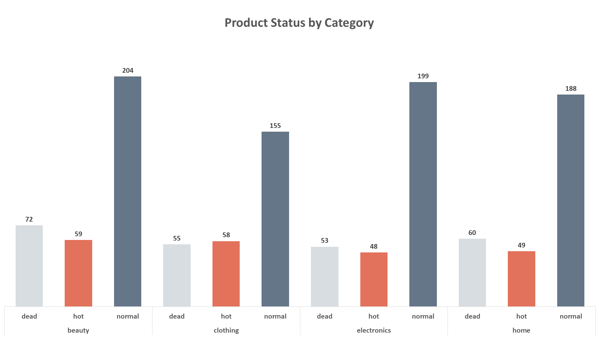
- Product distribution across categories and product types
appears relatively consistent throughout the dataset.
- In all categories, **normal** products represent the majority of products,
while **hot** and **dead** products appear in smaller and relatively similar proportions.
- This balanced distribution may indicate that **product_type** values
are **predefined labels** rather than classifications directly derived
from actual product performance or sales behavior.
---
| Variable       | Value                      |
| -------------- | -------------------------- |
| min_price                 | 50.68           |
| max_price                 | 4,990.19        |
| avg_price                 | 1092.76         |
| price_range               | 4,939.51        |
| 1st_quratile              | 299.33          |
| median / 2nd_quratile     | 568.68          |
| 3rd_quratile              | 1,294.33        |
| standard_deviation        | 1,217.12        |
- Product prices show **high variability** across the dataset,
with prices ranging from **50.68** to **4,990.19**.
- The wide price range is expected due to the presence
of multiple product categories with different pricing structures,
such as **low-priced beauty products** and **higher-priced electronics**.
- The average product price (**1,092.76**) is significantly higher
than the median price (**568.68**), indicating a **right-skewed** price distribution, This suggests that a smaller number of **high-priced products
are pulling the average upward**.
- Additionally, the large standard deviation (**1,217.12**) and the wide spread between quartiles indicate **substantial price dispersion** across products.
- These patterns suggest the possible presence of **high-price outliers**,
which may influence customer purchasing behavior and repeat purchase activity.
---
| category       | product_count | category_avg_price | category_min_price | category_max_price |
| -------------- | ------------- | ------------------ | ------------------ | ------------------ |
| electronics    | 300           | 2,841.24           | 500.69             | 4,990.19           |
| home           | 297           | 836.70             | 208.10             | 1,490.32           |
| clothing       | 268           | 456.34             | 101.83             | 796.99             |
| beauty         | 335           | 263.11             | 50.68              | 497.99             |
- Inspection of the highest- and lowest-priced products
further confirms the category-level pricing patterns observed earlier.
- The most expensive products are primarily electronics products,
while the lowest-priced products mainly belong to the beauty category.
- These observations support the previously identified right-skewed price distribution and reinforce the assumption that electronics products are major contributors to overall price variability.
---
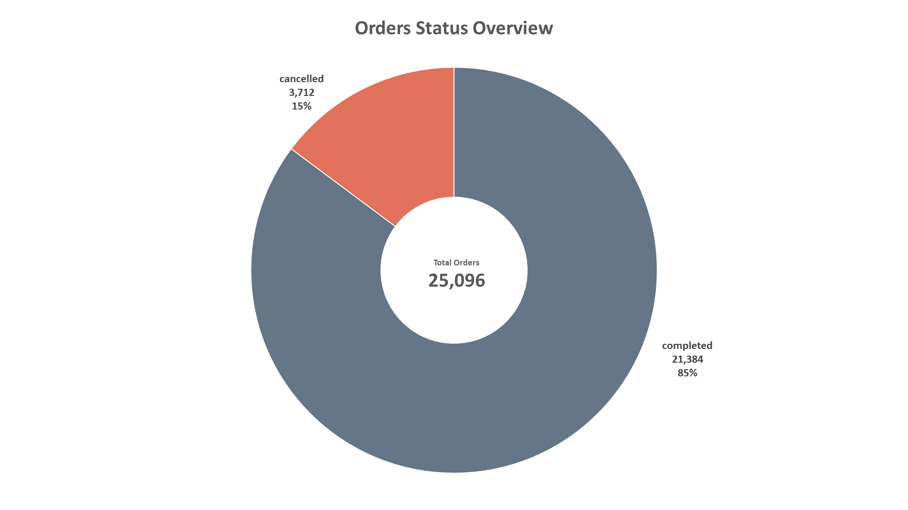
- **Completed** orders account for **85.21%** of all orders, while **cancelled** orders represent **14.79%** of total orders.
- Although the majority of orders are successfully completed, the **cancellation rate** is relatively noticeable and may negatively impact customer purchasing experience.
- This raises a potential business question regarding whether customers with cancelled orders are less likely to make repeat purchases in the future.
- Further analysis is required to examine the relationship between cancellation behavior and repeat purchase activity.
--- 
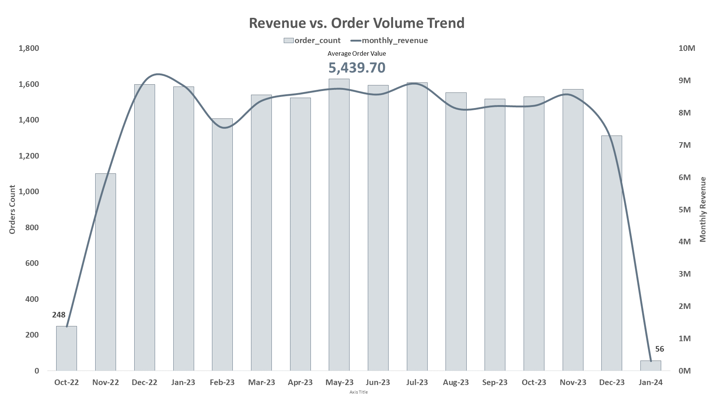
- Monthly **completed orders**, **average order value**, and **monthly revenue** remained relatively stable throughout most of the observed period.
- **October 2022** and **January 2024** show unusually low order volumes, which appear to be caused by incomplete monthly data coverage rather than actual business decline.
- Aside from these partial months, the platform demonstrates consistent operational performance,
with stable order activity and revenue generation over time.
- These findings suggest that low repeat purchase behavior may not be primarily driven by declining platform activity, but instead could be related to customer retention, purchasing behavior, pricing sensitivity, or other customer-level factors.
--- 
| Variable        | Value              |
| --------------- | ------------------ |
| min_order_value        | 51.04       |
| max_order_value        | 51,677.85   |
| avg_order_value        | 5,439.70    |
| 1st_quartile           | 1,635.56    |
| median / 2nd_quratile  | 3,814.43    |
| 3rd_quratile           | 7,849.45    |
- **Completed** order values show substantial variability across the dataset,
with order values ranging from **51.04** to **51,677.85**.
- The large gap between the **average order value** (**5,439.70**) and the **median order value** (**3,814.43**) indicates a right-skewed distribution, where a smaller number of high-value orders
are pulling the average upward.
- This pricing behavior is likely influenced by the wide variation in product prices across categories, particularly higher-priced electronics products compared to lower-priced beauty products.
- Additionally, the spread between quartiles suggests considerable variation in customer spending behavior, with the possible presence of high-value outlier orders.
---
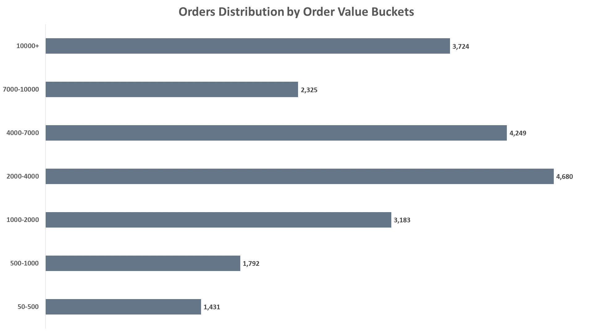
- **Completed** orders are distributed across multiple order value ranges, indicating relatively diverse customer spending behavior.
- The **highest** concentration of orders falls within the **2,000–4,000** range, followed by **higher-value** ranges above **4,000**, suggesting that customer purchases are not limited to low-value transactions only.
- **Lower-value** orders between **50** and **500** represent a smaller portion of completed orders, while **higher-value** order ranges continue to account for a substantial share of total order activity.
- These patterns suggest a relatively balanced distribution of customer spending levels across the platform, rather than extreme concentration within a single spending segment.
---
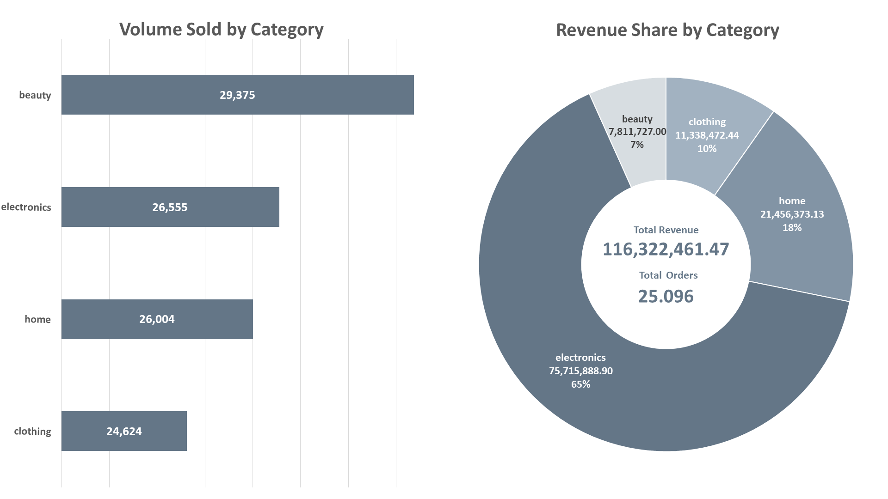
- Revenue contribution differs significantly across product categories.
- Although **electronics** products do not have the highest sales volume, they generate the **highest total revenue** by a substantial margin, reaching over **75 million** in revenue, This is primarily driven by their significantly higher average selling price compared to other categories.
- In contrast, **beauty** products have the **highest quantity sold** but generate the **lowest total revenue**, reflecting the category’s relatively low average selling price, This behavior appears consistent with the natural pricing structure of beauty products rather than indicating weak demand.
- Additionally, sales volumes across categories remain relatively balanced, suggesting stable customer demand across multiple product categories.
- Overall, the results indicate a strong relationship between average selling price and total category revenue, with higher-priced categories contributing disproportionately to overall revenue generation.
---
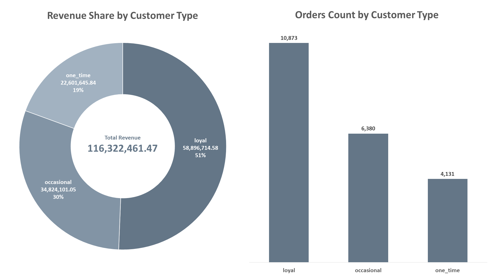
- Average order value remains relatively consistent
across all customer segments, with only minor differences between one-time, ccasional, and loyal customers.
- However, total revenue contribution differs substantially across segments, Customers labeled as **loyal** generate significantly higher revenue and account for the largest number of completed orders.
- In other words, **repeat purchasing behavior** appears to have a stronger impact on total revenue than differences in average order value.
- It is important to note that **customer_type** values are predefined labels and may not perfectly reflect actual customer purchasing behavior.

## **Key Business Questions**
**Overall Repeat Purchase Behavior**
- What is the overall repeat purchase rate, and what does it indicate about customer retention?

**Repeat Purchase by Product Category**
- Do certain product categories show weaker repeat purchase behavior compared to others?

**Pricing Impact on Repeat Purchases**
- Does product or order pricing influence customers’ likelihood of making repeat purchases?

**Cancellation Impact on Customer Retention**
- Are customers with cancelled orders less likely to return and make future purchases?

**Geographic Differences in Repeat Behavior**
- Does repeat purchase behavior vary across different cities or regions?

**Revenue Contribution of Repeat Customers**
- How much do repeat customers contribute to overall revenue and order volume?

**Time-Based Purchasing Trends**
- Has repeat purchase behavior changed over time, or remained stable throughout the observed period?

## **Analysis**
### **Overall Repeat Purchase Behavior**
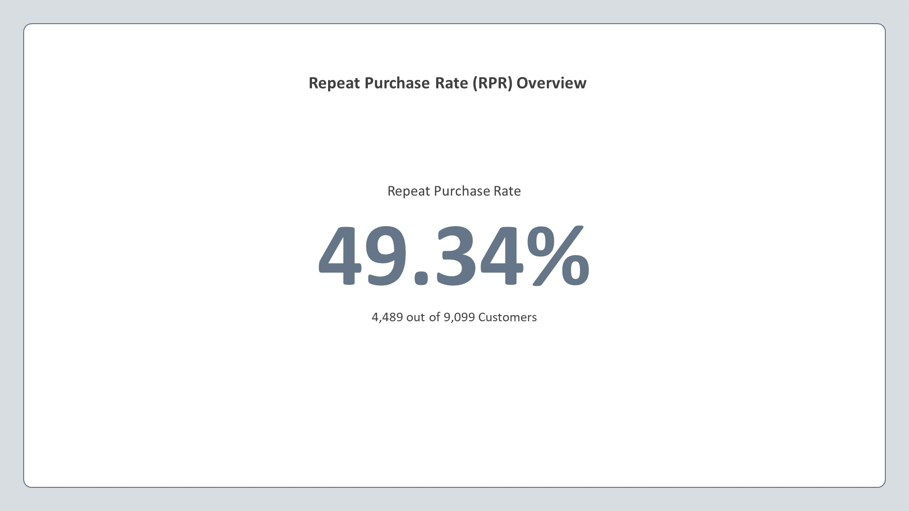
- Approximately **49.34%** of customers made more than one **completed** purchase.
- This indicates that nearly half of customers returned to make additional purchases after their initial transaction.
- While repeat purchase rate is not a direct measure of customer retention, it serves as a strong retention indicator. The result suggests that the platform demonstrates a moderate to healthy level of customer retention, with a substantial portion of customers returning to purchase again.
- Interestingly, the overall repeat purchase rate does not appear critically low at the platform level, This suggests that any retention challenges may be concentrated within specific **customer segments**, **product categories**, **pricing ranges**, or **behavioral patterns** rather than affecting the entire customer base.
- Further analysis is required to identify which factors most influence repeat purchasing behavior.
---
### **Repeat Purchase by Product Category**
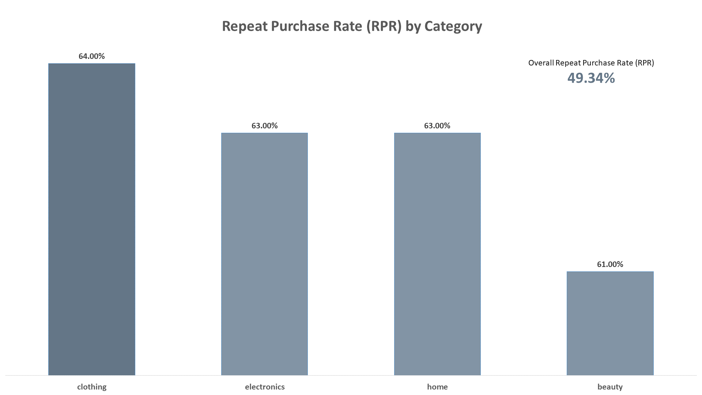
- The product categories exhibit a highly consistent and stable **Repeat Purchase Rate** (RPR), ranging narrowly between **61.00%** and **64.00%**.
- This uniform performance indicates that customer retention and product satisfaction are balanced across the platform, customers purchasing from **lower-volume** or **lower-priced** categories (such as **Beauty**) demonstrate a **similar level of loyalty** to those buying from high-revenue segments (such as **Electronics**).
- Interestingly, every individual category **outperforms** the overall platform repeat purchase rate of **49.34%**, This suggests that when customer activity is analyzed within the context of specific product departments, the data reveals a healthier pattern of **repeat engagement** than the consolidated platform metric indicates.
- Since product categories show no critical signs of underperformance or structural retention issues, any overarching retention challenges are likely not **category-driven**.
---
### **Pricing Impact on Repeat Purchases**
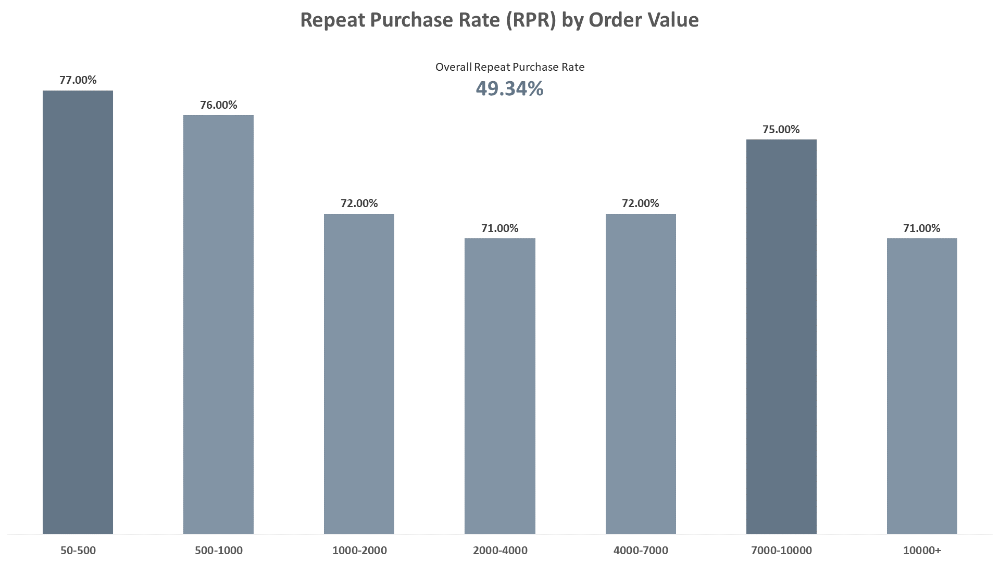
- Repeat purchase rates remain relatively consistent across all order value segments, ranging between **71%** and **77%**.
- No clear relationship was observed between order value and repeat purchasing behavior. Customers who placed **higher-value** orders did not demonstrate significantly different repeat purchase rates compared to customers with **lower-value** orders.
- This suggests that order pricing alone is unlikely to be a primary driver of repeat purchase behavior within the platform.
- Further analysis should focus on other potential factors such as cancellation behavior, customer location, or other customer-specific characteristics.
---
### **Cancellation Impact on Customer Retention**
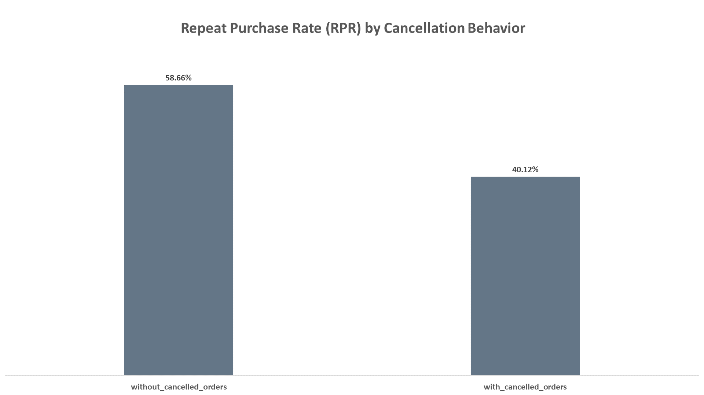
- **Customers who experienced at least one cancelled order demonstrated substantially lower repeat purchase behavior compared to customers with no cancellation history**.
- The repeat purchase rate declined from **58.66%** among **customers without cancelled** orders to **40.12%** among customers **with cancelled orders**.
- This suggests that order cancellations may negatively impact customer retention and future purchasing behavior, making cancellation reduction a potential opportunity for improving repeat purchases.
---
### **Geographic Differences in Repeat Behavior**
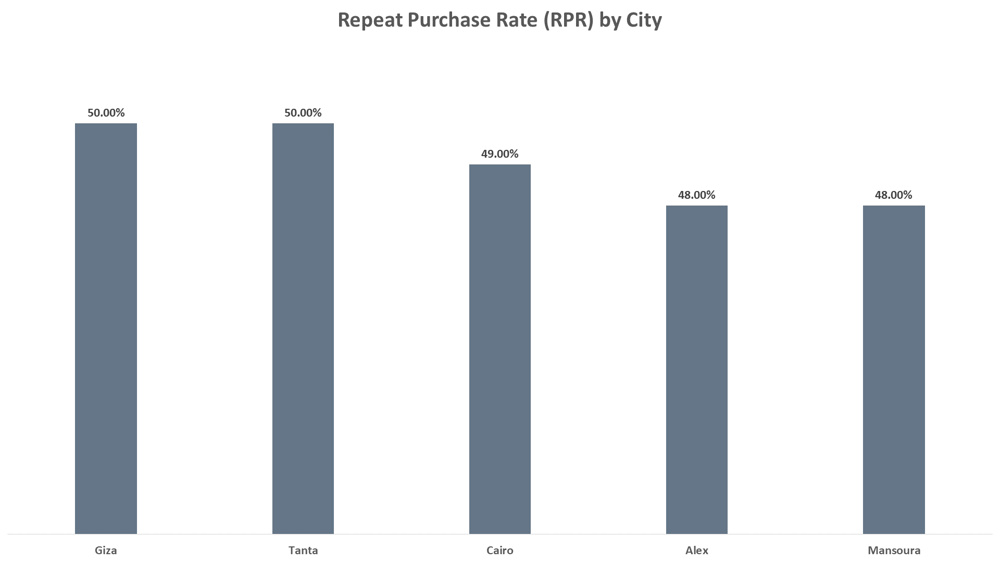
- Repeat purchase rates remain highly consistent across all cities, ranging between **48%** and **50%**.
- No significant geographic differences were observed in customer repeat purchasing behavior. The results suggest that customer location is unlikely to be a major factor influencing repeat purchases on the platform.
- The **city-level repeat purchase rates** closely align with the **overall repeat purchase rate** (**49.34%**), further indicating a stable retention pattern across regions.
---
### **Revenue Contribution of Repeat Customers**
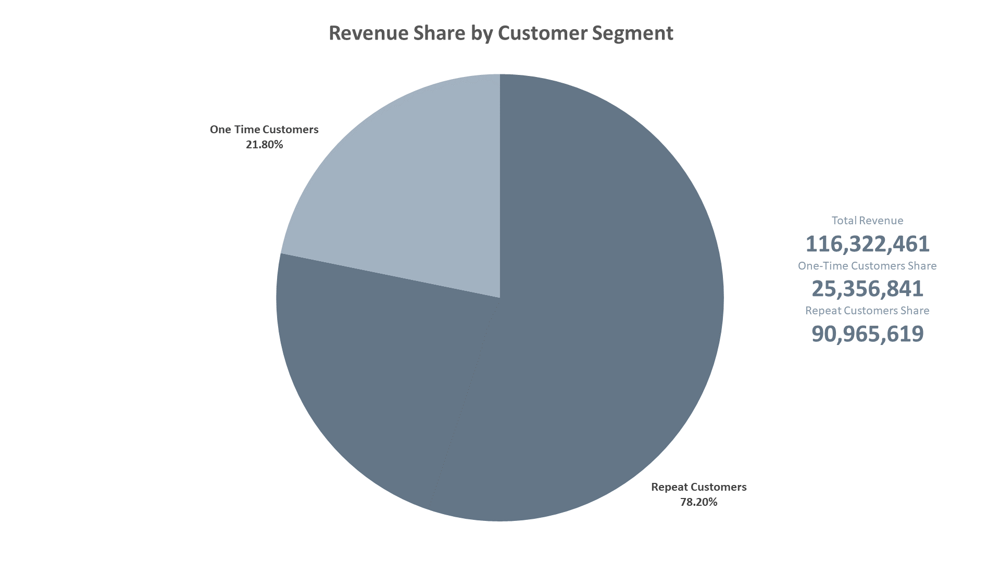
- Although **repeat customers** represent only **49.34%** of customers with completed orders, they generate **78.20%** of total revenue and account for **16,774** completed orders.
- This indicates that **repeat customers** are the primary revenue drivers of the business, Their contribution to revenue is disproportionately higher than their share of the customer base.
- As a result, improving repeat purchase behavior and customer retention could have a significant impact on future revenue growth.
---
### **Time-Based Purchasing Trends** 
![]